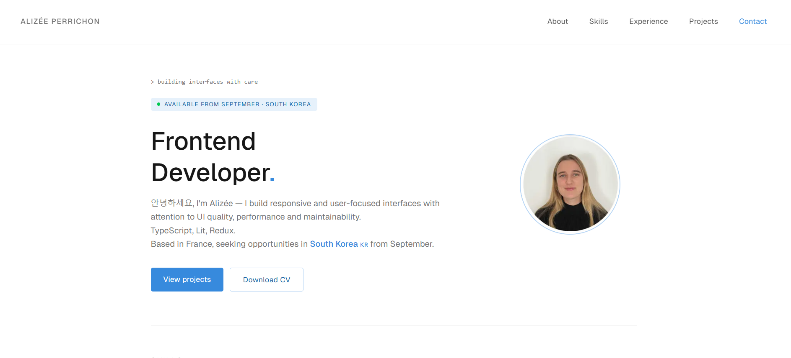

# Portfolio — Alizée Perrichon

Frontend developer portfolio featuring projects, experience, and a focus on clean, user-centered interfaces. Built with Next.js, Tailwind CSS, and Framer Motion.

🌐 https://alizee-perrichon.vercel.app


## 📸 Preview



## 🛠️ Tech stack

- Next.js 15 — App Router
- Tailwind CSS v4
- Framer Motion
- TypeScript
- Deployed on Vercel

## ✨ Features

- Portfolio layout to present projects, experience, and professional profile
- Scroll-triggered animations with Framer Motion
- Responsive design
- Project showcase with lightbox preview
- Image optimization with Next.js `<Image>`
- Downloadable CV

## 🎯 Learning goals

This project was an opportunity to explore and apply:

- **Next.js App Router** — structuring the application with the App Router architecture
- **Framer Motion** — implementing scroll-based animations with `useInView` and `AnimatePresence`
- **Tailwind CSS v4** — new `@theme` syntax and CSS variables

## 🚀 Getting started

### Prerequisites

Make sure you have **Node.js** installed on your machine.
You can download it at [nodejs.org](https://nodejs.org) — download the **LTS** version.

Check your installation:

```bash
node -v
npm -v
```

### Installation

**1. Clone the repository**

```bash
git clone https://github.com/AlizeePe/portfolio.git
```

**2. Navigate to the project folder**

```bash
cd portfolio
```

**3. Install dependencies**

```bash
npm install
```

**4. Start the development server**

```bash
npm run dev
```

**5. Open your browser at**
http://localhost:3000

---

## 📝 Available scripts

```bash
npm run dev      # Start development server
npm run build    # Build for production
npm run start    # Start production server
npm run lint     # Run ESLint
```

Built and designed by Alizée Perrichon
